# Unity Game Systems Portfolio

Unity C# 기반 **게임 시스템 및 기능 프로토타입 포트폴리오**입니다.

개인 기술 프로토타입인 **Unity Skill Logic Prototype**과 팀 프로젝트 『필연과 우연』, 『네 발자국』, 『헤이 치즈!』에서 직접 설계하고 구현한 주요 시스템 코드를 정리했습니다.

> **Featured Project — Unity Skill Logic Prototype**
> 전투 스킬 명세를 `Data → Runtime State → Validation → Execution → Feedback` 단계로 분해하고 검증한 Unity C# 기술 프로토타입입니다.

---

## 📌 프로젝트 개요

### Unity Skill Logic Prototype

**전투 스킬 로직 기술 검증 프로토타입** | Solo Development

#### 🎮 Combat Screenshots

| Normal | DoT Skill |
| ----------------------------------------------------------------------- | ----------------------------------------------------------------------- |
| 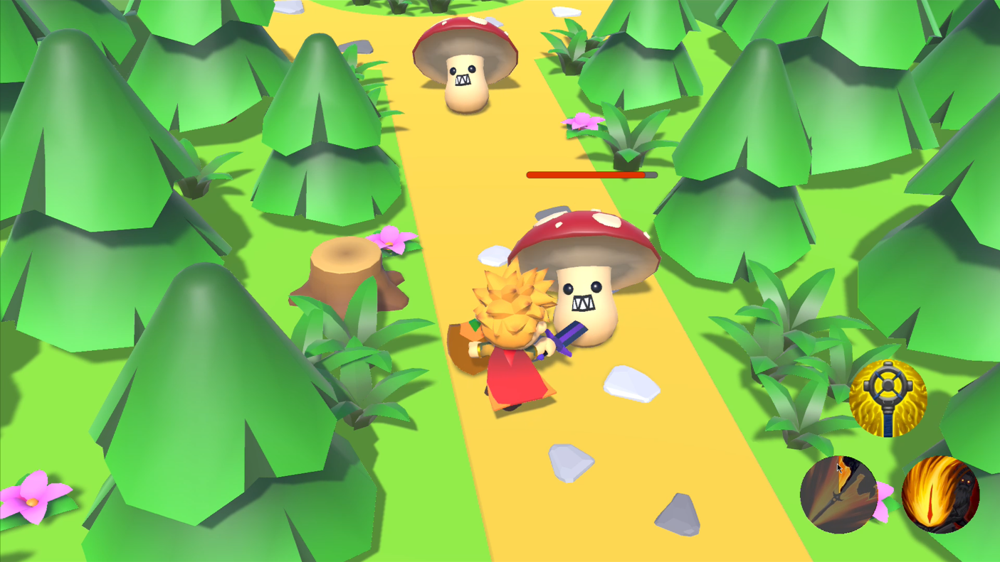 | 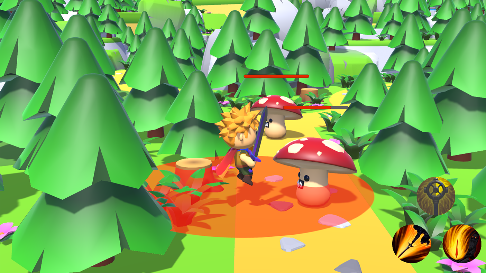 |
| |

일반적인 전투 스킬 명세를 정적 데이터, Runtime 상태, 실행 조건 검증, 효과 적용, 전투 피드백 단계로 분해해 구현했습니다. 
ScriptableObject 기반 스킬 데이터와 슬롯별 Runtime 상태를 분리하고, Normal·DoT·Area 스킬의 서로 다른 실행 규칙을 공통 실행 흐름 안에서 처리했습니다. 
대상 없음, 사거리 초과, 쿨타임 중 재사용, 사망 대상 제외, 다중 Collider 중복 피해 등 정상·실패·경계 조건을 기능 검증 시나리오로 확인했습니다. 
**개인 기술 프로토타입** | 기능 구현 및 검증 영상 2종

 

────────────────────────

 

### 『필연과 우연』

#### 📱 Screenshots

| 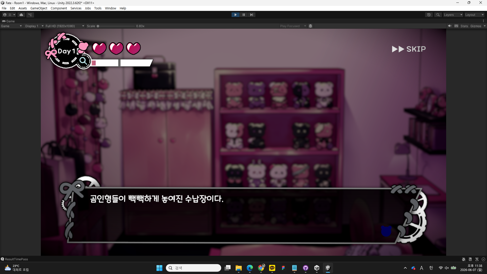 | 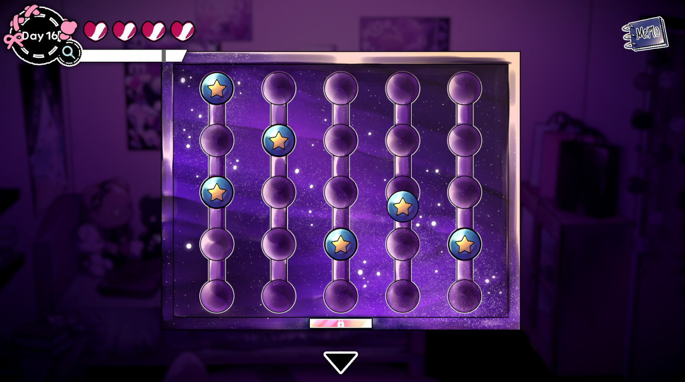 | 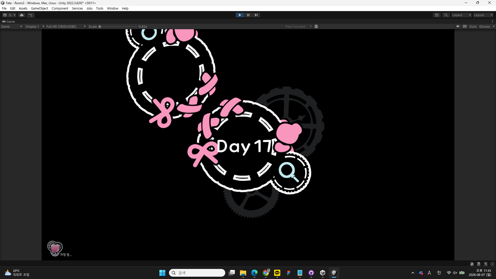 |
| -------------------------------------------------- | -------------------------------------------------- | -------------------------------------------------- |

**멀티엔딩 방탈출 어드벤처 게임** 
퍼즐, 상호작용 오브젝트, 행동력·날짜 시스템, 사운드 시스템 등 핵심 게임플레이 시스템을 설계하고 구현했습니다. 
**STOVE·App Store 출시** | 2025 BIC 전시 참여

 

────────────────────────

 

### 『네 발자국』

#### 📱 Screenshots

| 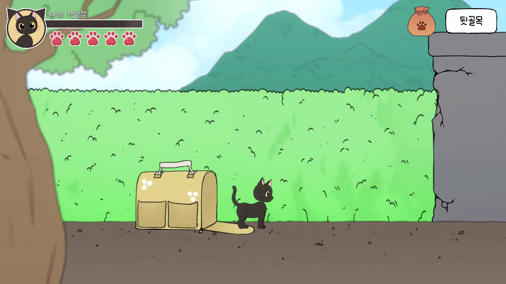 | 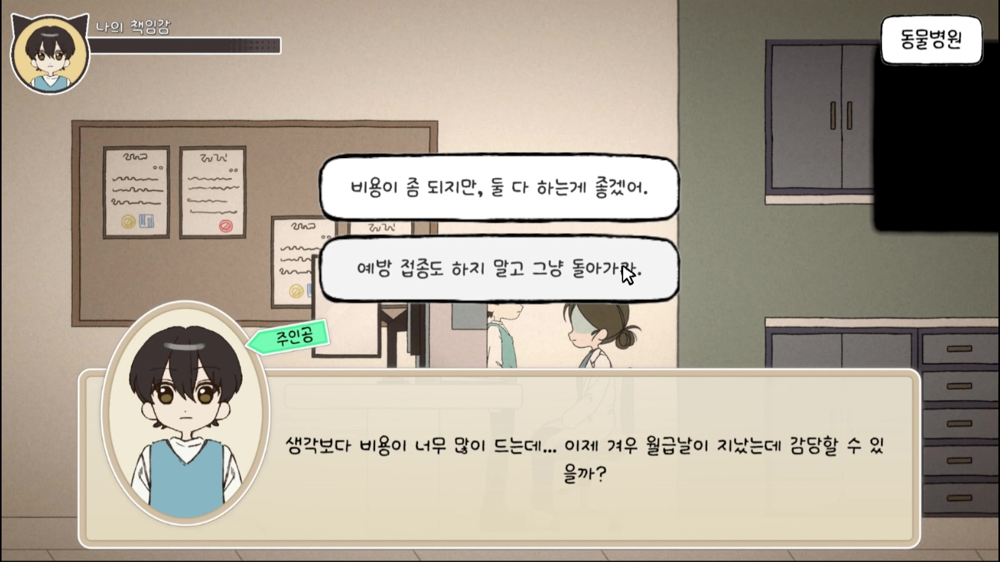 | 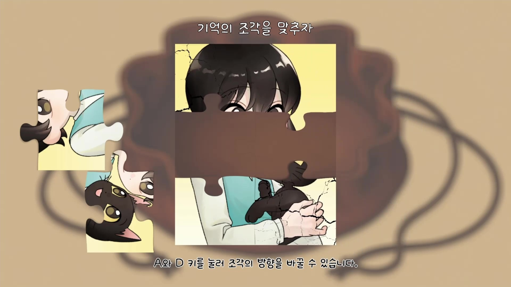 |
| ----------------------------------------------------------- | ----------------------------------------------------------- | ----------------------------------------------------------- |

**반려동물 유기**를 주제로 한 **2D 내러티브 어드벤처** 
대화(Dialogue), 이벤트(Event), 결과(Result) 처리 시스템을 데이터 주도 설계 기반으로 구현했습니다. 
학술 연구용 플레이 로그 수집 시스템을 직접 설계·구현했습니다. 
**STOVE 출시** | 학술저널 제1저자 게재 (2026.05)

 

────────────────────────

 

### 『헤이 치즈!』

#### 📱 Screenshots

| 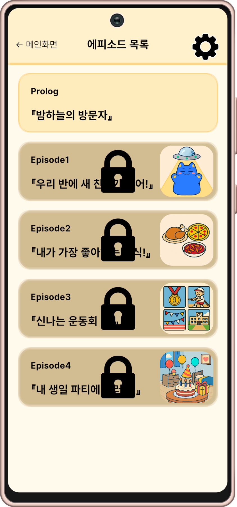 | 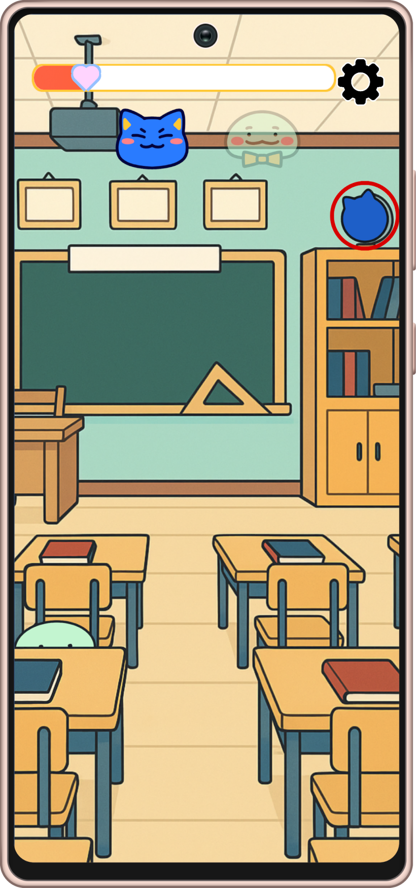 | 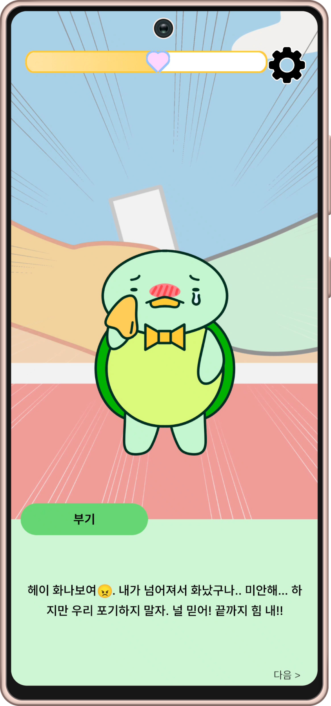 |
| --------------------------------------------------- | --------------------------------------------------- | --------------------------------------------------- |

**경계선 지능 아동의 감정 표현**과 **사회적 관계 형성**을 돕는 **Android 기반 교육용 인터랙티브 콘텐츠** 
에피소드형 미니게임의 진행 흐름, 터치 기반 오브젝트 상호작용, 상태 기반 피드백 구조를 구현했습니다. 
**사용자 테스트용 빌드 제작** | JCCT 학술논문 제2저자 게재

 

---

## 🛠️ 기여한 주요 시스템

| 시스템                           | 프로젝트                        | 핵심 기술                                                             |
| ----------------------------- | --------------------------- | ----------------------------------------------------------------- |
| Skill Data & Runtime System   | Unity Skill Logic Prototype | ScriptableObject, 정적 데이터·Runtime 상태 분리, 슬롯별 쿨타임                   |
| Skill Execution & Validation  | Unity Skill Logic Prototype | 대상 탐색, 사거리 검증, 실행 성공 여부, Normal·DoT·Area 분기                       |
| Target & Status Effect System | Unity Skill Logic Prototype | OverlapSphereNonAlloc, sqrMagnitude, HashSet 중복 제거, Coroutine DoT |
| Combat Feedback System        | Unity Skill Logic Prototype | C# Event, Presenter, Health Bar, Cooldown UI, Range Indicator     |
| Player Control Integration    | Unity Skill Logic Prototype | Camera-relative Movement, Rigidbody, 공격 대상 방향 전환                  |
| Puzzle Systems                | 필연과 우연                      | Unity UI 이벤트, 드래그 앤 드롭, 좌표 변환, 제약 로직                              |
| Interaction Systems           | 필연과 우연                      | 공통 인터페이스 설계, Lerp 이동 애니메이션, 세이브 연동                                |
| Action Point System           | 필연과 우연                      | 추상 클래스와 상속, Coroutine 기반 날짜 전환 애니메이션                              |
| Room Manager                  | 필연과 우연                      | 다중 상태 통합 관리, UIManager 동기화, 입력 방지                                 |
| Sound System                  | 필연과 우연                      | 우선순위 채널, Voice Stealing, Round Robin, Debounce                    |
| Dialogue System               | 네 발자국                       | Queue 기반 비동기 제어, 타자 효과, 말풍선, 선택지 분기                               |
| Event & Result System         | 네 발자국                       | CSV 파싱, 데이터 주도 설계, AND·OR 조건, Coroutine Pipeline                  |
| Save System                   | 네 발자국                       | Atomic Write, Newtonsoft.Json, 타입 정보 보존, Fallback 복구              |
| Log Tracking System           | 네 발자국                       | UnityWebRequest, Queue 재전송, GAS 연동, 중복 방지                         |
| Mini-game Flow System         | 헤이 치즈!                      | 추상 MiniGameManager 기반 시작·클리어·재시작·스토리 복귀 흐름                        |
| Touch Interaction Mini-games  | 헤이 치즈!                      | 터치 기반 캐릭터 찾기, 음식 선택, 오브젝트 정리, 진행도 조작                              |
| State-based Feedback System   | 헤이 치즈!                      | Dictionary, Slider, UI Text, Sprite 기반 상태 피드백                     |
| Coroutine-based Game Progress | 헤이 치즈!                      | 제한 시간, 카운트다운, 이동 연출, 랜덤 이벤트, 클리어 조건                               |

---

## 📂 Quick Links

### Unity Skill Logic Prototype

* [Project Overview](./UnitySkillLogicPrototype/README.md)
* [Skill Data & Runtime System](./UnitySkillLogicPrototype/SkillDataRuntimeSystem/README.md)
* [Skill Execution System](./UnitySkillLogicPrototype/SkillExecutionSystem/README.md)
* [Combat Feedback System](./UnitySkillLogicPrototype/CombatFeedbackSystem/README.md)
* [Player Control System](./UnitySkillLogicPrototype/PlayerControlSystem/README.md)

### 『필연과 우연』 (FateAndAccidy)

* [Puzzle Systems](./FateAndAccidy/PuzzleSystems/README.md)
* [Interaction Systems](./FateAndAccidy/InteractableObjects/README.md)
* [Action Point System](./FateAndAccidy/ActionPointSystem/README.md)
* [Room Manager](./FateAndAccidy/RoomManager/README.md)
* [Sound System](./FateAndAccidy/SoundSystem/README.md)

### 『네 발자국』 (FourFootsteps)

* [Dialogue System](./FourFootsteps/DialogueSystem/README.md)
* [Event & Result System](./FourFootsteps/Event&ResultSystem/README.md)
* [Save System](./FourFootsteps/SaveSystem/README.md)
* [Log Tracking System](./FourFootsteps/LogSystem/README.md)

### 『헤이 치즈!』 (HeyCheese)

* [Mini-game Interaction System](./HeyCheese/README.md)

---

## 🎬 유튜브 시연 영상

### Unity Skill Logic Prototype

* [Combat Logic & UI Feedback](https://youtu.be/COhs8v4ZTNY?si=X1HxetiwKpY-we-C)
* [Feature Verification](https://youtu.be/QM03HsZIwEM?si=Y25z8ThtY_cNN9pa)

### Team Projects

* [『필연과 우연』](https://youtu.be/kjaH9fDRmMo)
* [『네 발자국』](https://youtu.be/013OU2ZJlbk)
* [『헤이 치즈!』](https://youtu.be/4RVUEoXP8Yw?si=HcLrg0qtpwAvmj4N)
